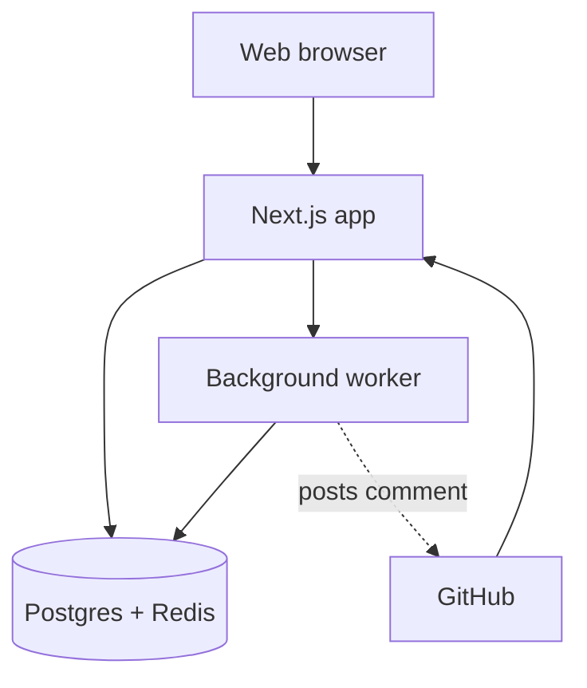

# PatchWatch — Architecture

**What this document is:** how the pieces are built and how they talk to each other. Read `PROJECT_SPEC.md` first — this document uses words defined there (workspace, installation, scan run, finding).

---

## 1. The big picture

Three things send information into one app:

- A developer's web browser (looking at the dashboard)
- GitHub (sending a webhook — a message GitHub sends us the moment something happens, like a pull request opening)
- Later, in Phase 2: the VS Code extension

That one app is our **Next.js app**. It's the only piece that talks directly to the outside world.

When the Next.js app gets heavy work to do — scanning a pull request — it doesn't do that work itself. It hands the job to a **background worker**, which does the slow part without making anyone wait.



(The VS Code extension joins this picture in Phase 2, calling the Next.js app the same way the browser does.)

## 2. The pieces, one by one

### Next.js app (`apps/web`)

Does three jobs:

1. Shows the dashboard pages people see in their browser.
2. Receives GitHub's webhooks.
3. Answers requests from the dashboard for data — list of repos, past scans, and so on.

It logs people in with NextAuth ("Sign in with GitHub"). This is a **separate thing** from the GitHub App — see section 4 below, it's worth reading carefully.

### Background worker (`apps/worker`)

Built with Trigger.dev. Holds every slow step in one place: fetch the changed files from the pull request, run Semgrep on them, ask the AI model for a suggested fix per finding, post the results back to GitHub, then save everything to the database.

We use Trigger.dev instead of running our own always-on worker, because it handles retries for us and we don't have to pay for a server that just sits there waiting.

### Database: Postgres + Redis

**Postgres** (through Prisma) stores everything permanent: users, workspaces, repos, scan runs, findings.

**Redis** handles two short-lived jobs: caching (so we don't ask GitHub the same question twice in a row) and rate limiting (so nobody can overload our webhook).

### Shared packages (`packages/`)

This is where the real logic lives — the "rooms" from our door/room idea. Both the app and the worker use these:

- `db` — the Prisma schema and generated client.
- `shared-types` — validation rules (Zod) and the TypeScript types built from them, so the app and worker always agree on what a "finding" looks like.
- `detection-engine` — runs Semgrep, turns its raw output into one clean shape.
- `ai-client` — sends a finding to the AI model, gets back a checked, structured fix suggestion.
- `github-client` — everything about talking to GitHub: turning an installation into a usable access token, fetching a PR's changed files, posting a comment.
- `core` — the dashboard's own logic (get a workspace's repos, get scan history). Route files in `apps/web` stay thin — they just call one function from here and return the result.

## 3. How one pull-request scan flows, step by step

1. A developer opens or updates a pull request.
2. GitHub sends a webhook to our Next.js app.
3. The app checks the webhook is genuinely from GitHub, then immediately replies "got it" and hands the real work to the background worker. This reply has to be fast — GitHub expects a quick response.
4. The worker fetches only the changed files (not the whole repo).
5. The worker runs Semgrep on those files.
6. For each problem found, the worker asks the AI model for a plain-English explanation and a suggested fix.
7. The worker posts one comment on the pull request with the findings — or "no issues found" if it's clean.
8. The worker saves the scan run and its findings to the database.
9. Next time someone opens the dashboard, that scan shows up in the history.

## 4. Two separate logins — read this twice, it trips people up

- **NextAuth login** answers: "who is looking at the dashboard right now?" A person signs in with their GitHub account, same as signing into any website with GitHub.
- **GitHub App installation** answers: "which GitHub organizations gave PatchWatch permission to read their code and post comments?" This belongs to the whole workspace, not to any one person.

A person can be logged in with nothing installed yet — they just can't scan anything until their workspace installs the app. And the GitHub App posts comments automatically, with no human "logged in" at that moment at all. That's the point — it's automatic.

## 5. Decisions made so far, and why

- **Next.js Route Handlers, not a separate Express/Fastify service** — fewer moving parts for Phase 1. Logic lives in `packages/core`, not in the route files, so we can add a separate API service later without rewriting anything.
- **Trigger.dev, not a hand-run job queue** — no server bill just to keep a worker waiting 24/7.
- **Semgrep, not a custom-built scanner** — a mature, free tool beats reinventing years of security rules.
- **GitHub only, no GitLab yet** — one integration done well before a second, differently-shaped one.
- **A hosted AI model, not a fine-tuned one** — no GPU hosting bill, and a good prompt covers what Phase 1 needs.

## 6. Folder structure

```
patchwatch/
├── apps/
│   ├── web/                  # Next.js: dashboard + API routes + webhook receiver + login
│   ├── worker/                # Trigger.dev background tasks
│   └── vscode-extension/      # Phase 2
├── packages/
│   ├── db/                    # Prisma schema, migrations, generated client
│   ├── shared-types/          # Zod schemas + shared TypeScript types
│   ├── detection-engine/      # Semgrep wrapper
│   ├── ai-client/              # AI prompt + response handling
│   ├── github-client/         # GitHub App auth + API calls
│   └── core/                   # Dashboard business logic
├── docs/                       # this document and its neighbors
├── docker-compose.yml           # local Postgres + Redis only
├── turbo.json
└── pnpm-workspace.yaml
```

## 7. Related documents

- `PROJECT_SPEC.md` — what we're building and why.
- `API_CONTRACTS.md` — exact request/response shapes (written next).
- `ROADMAP.md` — day-by-day build order.
